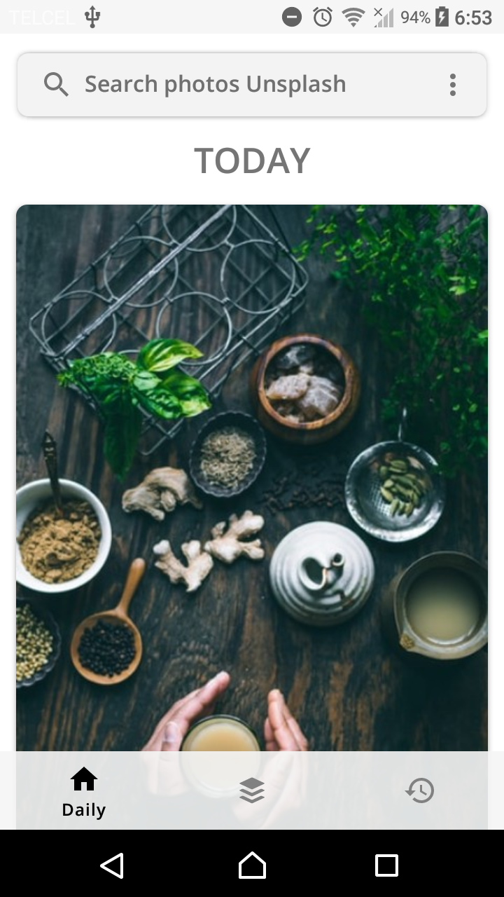
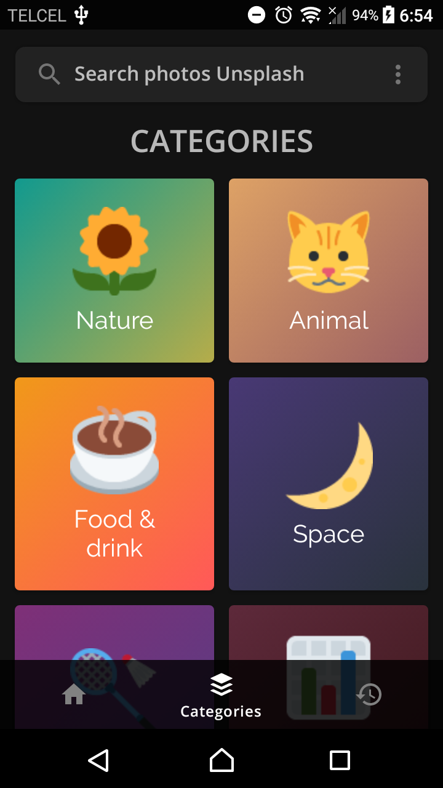
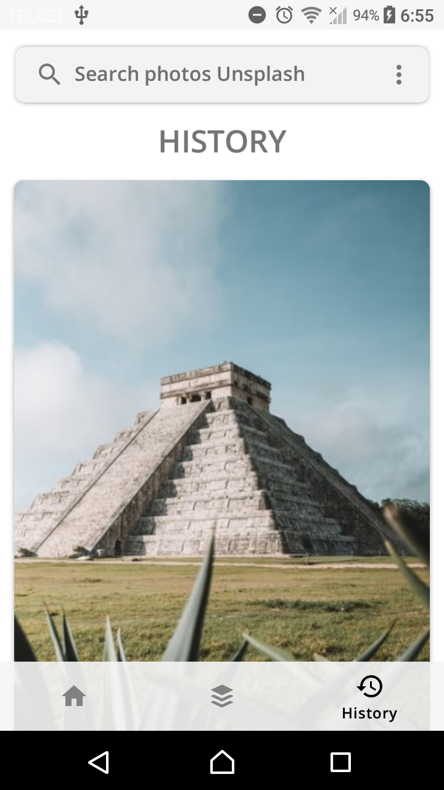
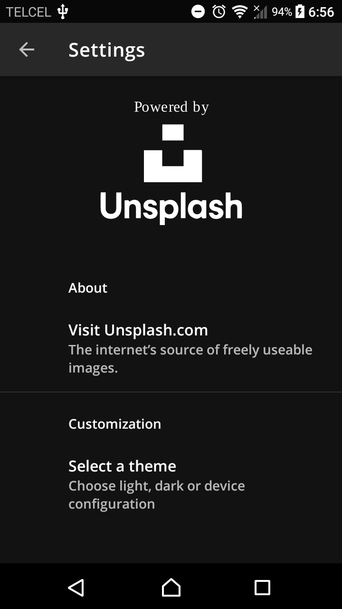

   
  <h1 align="center">Fondo</h1>
  <h4 align="center">Find the most beautiful wallpapers for Android</h4>

            

 

    <table>
      <tr>
        <td>
          
        </td>
        <td>
          
        </td>
        <td>
          
        </td>
        <td>
          
        </td>
      </tr>
    </table>

  <a href="https://github.com/calo001/fondo-android/issues">Report a problem!</a>

## Special thanks

  

Beautiful, free photos.
Gifted by the world’s most generous community of photographers. 🎁

## License

This project is licensed under the AGPL-3.0 License - see the [LICENSE](LICENSE.md) file for details.
